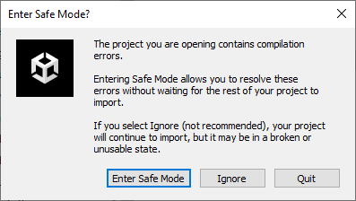
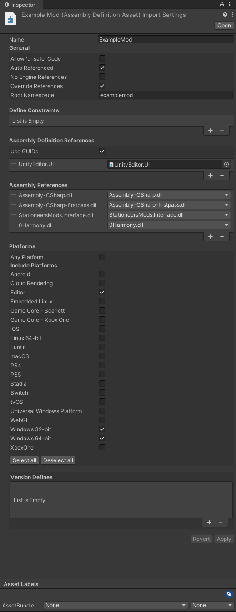
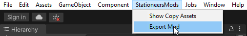
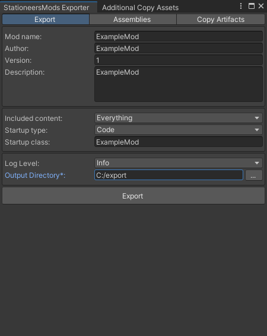
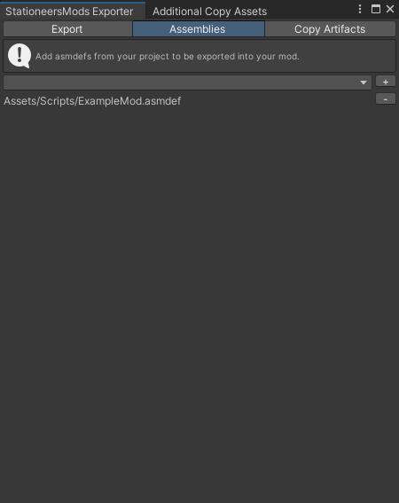
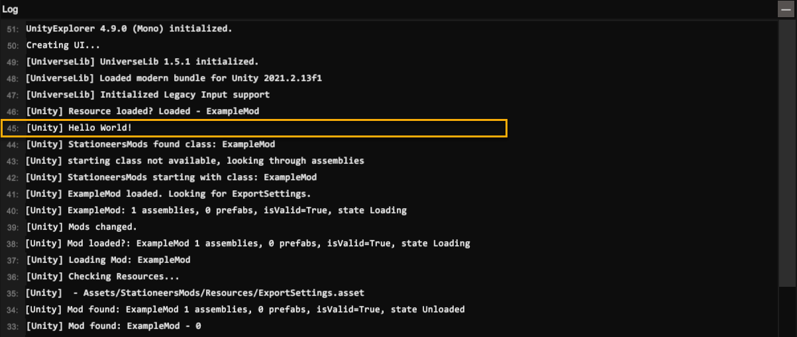

# Creating a unity mod

This guide will help you build your first mod and load it in the game. You can adapt it afterwards to your needs.
This guide is written Unity version 2021.2.13f1.

## Import template
Download the [ExampleMod](ExampleMod.zip). This contains a working starter mod you can easily adapt.

- Extract the zip into a project folder (ex. ExampleMod)
- In Assets/Assemblies there is a README. This contains a list of dll's you need to copy over.
- In Assets/StationeersMods is the exporter plugin for Unity. You should update this with the latest version of StationeersMods-exporter.zip from [Github](https://github.com/jixxed/StationeersMods/releases).
- Open the folder in the Unity Hub and open the project.

If the project fails to compile you will get an error:

You can click Ignore and try to fix the issues. This will usually be related to changes in the assemblies.

## Unity Editor 
Once the project is imported you can check the asmdef in the Scripts folder. it should look like this:

### TMP Fix
The game uses TextMeshPro. This requires a package in Unity. There is a bug in the TMP Code you can patch by replacing 2 files in: %localappdata%\Unity\cache\packages\packages.unity.com\com.unity.textmeshpro@3.0.6\Scripts\Runtime

You can get the files from [TMP_Fix.zip](TMP_Fix.zip).

The TextMeshPro package requirement is included in the project definition, so after the project is opened in Unity, the package is automatically downloaded and the folder above should become available.

**This is a one time patch**, since every new project will use the files from that location.

### Building the project
To build the mod you can open the exporter from the menu

Fill in the settings:

- **Mod name:** Name of your mod
- **Author:** Your (nick)name
- **Version:** Version of the mod
- **Description:** Description for your mod
- **Include Content:** Content to include. For this example it will be `Everything`
- **Startup Type:** Type of startup class. For this example it will be `Code`
- **Startup class:** Name of the startup class
- **Output Directory:** Description for your mod (set this to your local mods folder: C:\Users\\[USERNAME]\Documents\My Games\Stationeers\mods)

On the **Assemblies** tab add the .asmdef file

Back on the Export tab you can click export and your mod should be built into the output directory.

## Testing

Copy the mod over to the local mods folder (C:\Users\\[USERNAME]\Documents\My Games\Stationeers\mods) if you did not set it as the output directory.

Start the game and check the logs. This example mod writes a `Hello World!` to the log.

You can see it in game if you have the UnityExplorer plugin or if you check the game log
(AppData\LocalLow\Rocketwerkz\rocketstation\Player.log) 

## Modifications

To make the mod your own, replace ExampleMod **EVERYWHERE** with your own name. 
You can do this at the beginning, after extraction, by editing the files in the `Scripts` folder and the scene in the `Scenes` folder, before importing the project in Unity. 
The word `ExampleMod` should **NOT** appear anywhere before you publish. The scene also needs to have a unique name, otherwise it might conflict with other mods.

there is a `stationeersmods` file in the `About` folder. This file is mandatory for StationeersMods mods as a way to recognize the mod needs to be processed as a StationeersMods mod.

An overlay image is provided for you to use to create your own thumbnail.