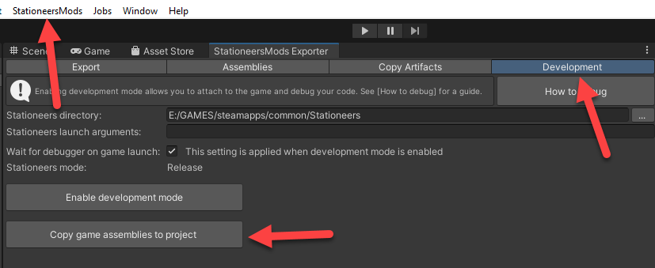

# Creating a unity mod

This guide will help you build your first mod and load it in the game. You can adapt it afterwards to your needs.

## Import template
Download the [ExampleMod](https://github.com/StationeersMods/ExampleMod). This contains a working starter mod you can easily adapt.

- Using Unity 2022.3.7f1, create a 3d Built-In Render Pipeline project for your mod
- Copy the ExampleMod project into your project folder
- In Assets/Assemblies there is a copy.txt file. This contains a list of dll's you need to copy over. This can be done with the click of a button inside the Unity Editor.
- In Assets/StationeersMods is the exporter plugin for Unity. You should update this with the latest version of StationeersMods-exporter.zip from [Github](https://github.com/jixxed/StationeersMods/releases).
- Open the folder in the Unity Hub and open the project.

If the project fails to compile you will get an error:

You can click Ignore and try to fix the issues. This will usually be related to changes in the assemblies.

## Copy assemblies
To copy the assemblies you can click the button in the editor, under StationeersMods -> Export Settings. Make sure you have the Stationeers game folder set in the exporter settings.
This action will copy over all the assemblies defined in the copy.txt file. Be aware that the game might add new assemblies in the future, so you might need to update this list.

## Unity Editor 
Once the project is imported you can check the asmdef in the Scripts folder. it should look like this:

### TMP Fix
The game uses TextMeshPro. This requires a package in Unity. There is a bug in the TMP Code you can patch by replacing 2 files in:  

| OS | PATH |
| ------------- | ------------- |
|**Windows**|%localappdata%\Unity\cache\packages\packages.unity.com\com.unity.textmeshpro@3.0.6\Scripts\Runtime|
|**Linux**|~/.config/unity3d/cache/packages/packages.unity.com/com.unity.textmeshpro@3.0.6/Scripts/Runtime|

You can get the files from [TMP_Fix.zip](TMP_Fix.zip).

The TextMeshPro package requirement is included in the project definition, so after the project is opened in Unity, the package is automatically downloaded and the folder above should become available.

**This is a one time patch**, since every new project will use the files from that location. It is recommended to delete your project and start again after this one time patch, since your current project still holds a bad copy of TMP.

### Building the project
To build the mod you can open the exporter from the menu

Fill in the settings:

- **Mod name:** Name of your mod
- **Author:** Your (nick)name
- **Version:** Version of the mod
- **Description:** Description for your mod
- **Include Content:** Content to include. For this example it will be `Everything`
- **Startup Type:** Type of startup class. For this example it will be `Code`
- **Startup class:** Name of the startup class
- **Output Directory:** Description for your mod (set this to your local mods folder)

| OS | local mods folder PATH |
| ------------- | ------------- |
|**Windows**|%userprofile%\Documents\My Games\Stationeers\mods|
|**Linux**|[steam location]/steamapps/compatdata/544550/pfx/drive_c/users/steamuser/Documents/My Games/Stationeers/mods|

On the **Assemblies** tab add the .asmdef file

Note that you do need to click the + icon, even if it automatically selected the file

Back on the Export tab you can click export and your mod should be built into the output directory.

## Testing

Copy the mod over to the local mods folder if you did not set it as the output directory.

| OS | local mods folder PATH |
| ------------- | ------------- |
|**Windows**|%userprofile%\Documents\My Games\Stationeers\mods|
|**Linux**|[steam location]/steamapps/compatdata/544550/pfx/drive_c/users/steamuser/Documents/My Games/Stationeers/mods|

Start the game and check the logs. This example mod writes a `Hello World!` to the log.

You can see it in game if you have the UnityExplorer plugin or if you check the game log

| OS | log file PATH |
| ------------- | ------------- |
|**Windows**|%userprofile%\appdata\LocalLow\Rocketwerkz\rocketstation\Player.log|
|**Linux**|[steam location]/steamapps/compatdata/544550/pfx/drive_c/users/steamuser/AppData/LocalLow/Rocketwerkz/rocketstation/Player.log|

## Modifications

To make the mod your own, replace ExampleMod **EVERYWHERE** with your own name. 
You can do this at the beginning, after extraction, by editing the files in the `Scripts` folder and the scene in the `Scenes` folder, before importing the project in Unity. 
The word `ExampleMod` should **NOT** appear anywhere before you publish. The scene also needs to have a unique name, otherwise it might conflict with other mods.

This should be done automatically if you used init.bat or init.sh as mentioned in the ExampleMod instructions

there is a `stationeersmods` file in the `About` folder. This file is mandatory for StationeersMods mods as a way to recognize the mod needs to be processed as a StationeersMods mod.

An overlay image is provided for you to use to create your own thumbnail.  Replace Preview.png and thumb.png with your own preview images if desired

Edit the About.xml file in Assets/About (in the Unity Project) as needed.  This will be copied to the output directory each time it's exported, and is not updated from the Export Settings

# Upload to Steam Workshop

To upload your mod to steam, go to the workshop menu in the main menu of the game. Select your mod and click Publish.
After you have published your mod, the `About.xml` file in the local mods folder will be updated with the workshop handle. You can also find this handle in the workshop url.
Copy this handle and add it in the `About.xml` inside your project.

WARNING: If you don't do this, the next time you publish, the mod will be uploaded as a new mod!