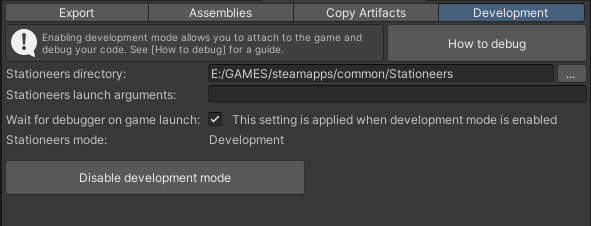
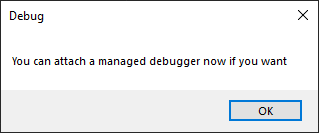
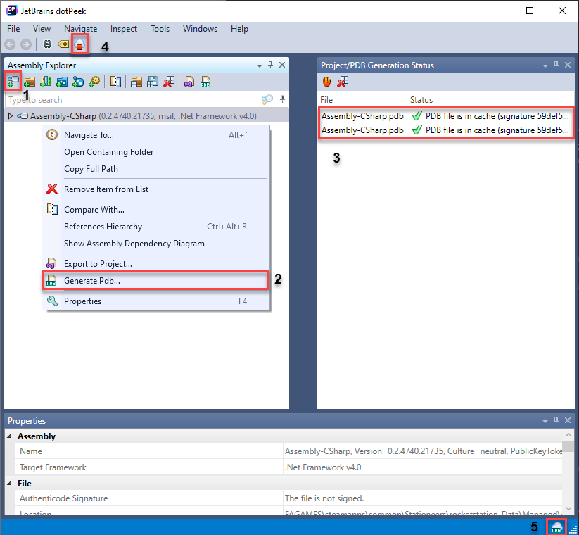
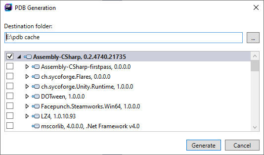
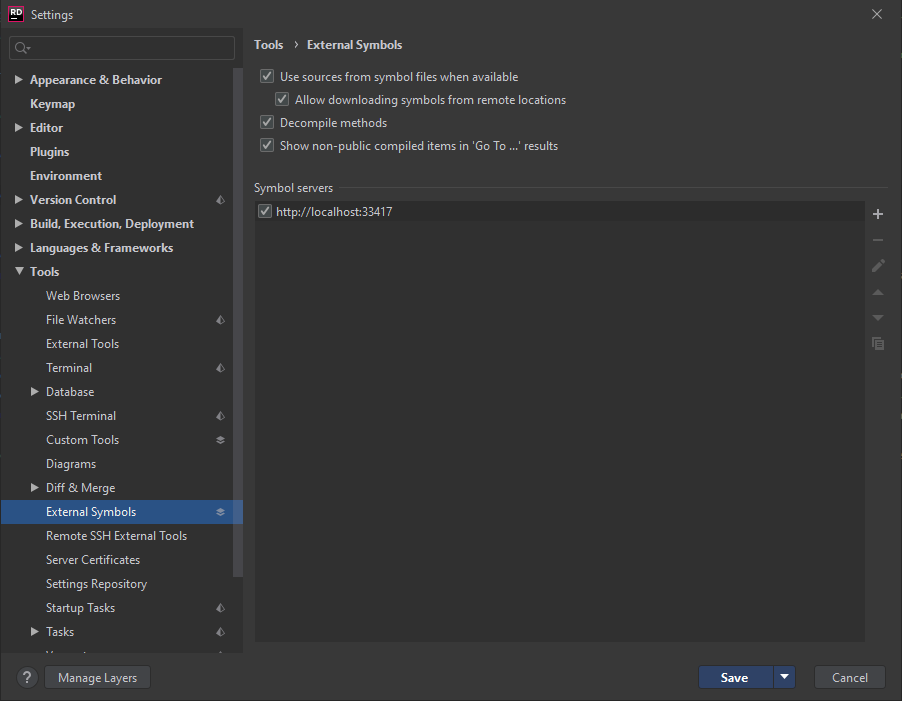
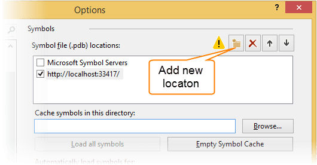
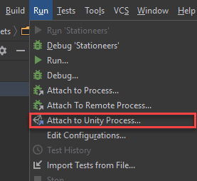
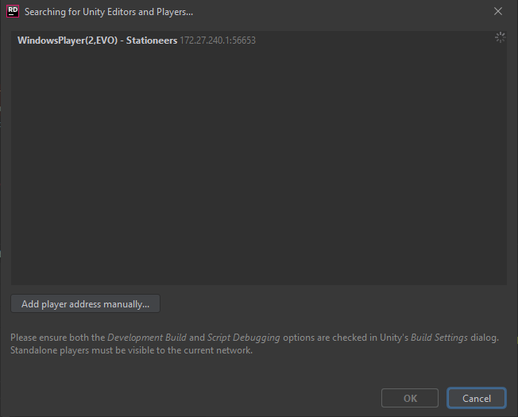

# Debugging

This guide describes how to configure debugging through StationeersMods and how to set up your IDE and Symbol server.

## StationeersMods
The first step is to set Stationeers to development mode. The automatic way to do this is to use the StationeersMods menu in Unity.

- navigate to the `Development` tab
- Configure the Stationeers directory to point to the game's root folder
- Configure launch arguments if you like, to be passed along with the executable if launched from StationeersMods in Unity (optional)
- Set `Wait for debugger` if you want the game to wait for you after lauch to attach the debugger (optional)\
The game will show the following dialog after launch\

- click `Enable development mode` to enable development mode. This button will change into `Disable development mode` to disable it again.

Alternatively, the steps to do it all manually are as follows:
- Edit `[game folder]/rocketstation_Data/boot.config` and add the lines: 
  - `player-connection-debug=1` for starting the debugger
  - `wait-for-managed-debugger=1` to have the game wait for you to attach a debugger (optional)
  - `player-connection-project-name=Stationeers` to set a nice name to list the application to debug with (optional)
- Download and install unity Unity 2021.2.13 Dated February 23, 2022 from [Unity Archive](https://unity.com/releases/editor/archive)
- Copy the following files from `[Unity installation folder]\Editor\Data\PlaybackEngines\windowsstandalonesupport\Variations\win64_player_development_mono`:
  - `WindowsPlayer.exe` to `[game folder]/rocketstation.exe`
  - `UnityPlayer.dll` to `[game folder]/UnityPlayer.dll`
  - `MonoBleedingEdge/EmbedRuntime/mono-2.0-bdwgc.dll` to `[game folder]/MonoBleedingEdge/EmbedRuntime/mono-2.0-bdwgc.dll`

After the game has been set to development mode, you should be able to attach a debugger. However, you need symbols to be able to actually debug.

To debug your own mod code when building a mod **with** Unity, make sure `Include Pdb's` is checked in the export settings.\
To debug your own mod code when building a standalone code mod **without** Unity:
- Visual Studio: Make sure you're building with debug information and `project properties -> Build -> Advanced... -> Debugging information` is set to "Portable". This is the only format supported by VSTU. 
- Rider: If you use the [ExamplePatchMod](ExamplePatchMod.zip) template, you can select the Debug build to include a Pdb file.
- Make sure the generated .pdb is copied along with the .dll to the exported mod folder.
## JetBrains dotPeek

>This step is not technically required when using Rider, but it greatly accelerates navigating through decompiled classes and serves as a central decompiler if you have multiple mods.

To be able to debug the game's own code you need Pdb's for the game assemblies. This guide shows how to setup a symbol server for your IDE.\
First install dotPeek from [jetbrains.com](https://www.jetbrains.com/decompiler/)  or through the [JetBrains Toolbox](https://www.jetbrains.com/toolbox-app/).\

1. When you open the application, add `[game folder]/rocketstation_Data/Managed/Assembly-CSharp.dll` to the list.
2. After that, Generate the Pdb by right-clicking the assembly and selecting `Generate Pdb...`
Select a folder to store generated Pdb's(somewhere outside the gamefolder) and click `Generate`. This folder holds all the Pdb's you generate and can contain multiple versions of the same assembly!\

3. You can open the Project/PDB Generation Status window under the Windows menu. in this menu you will see the status of the Pdb generation. this may take a while depending upon the assembly. The symbol server will decompile newer versions automatically when first accessed in the IDE, but you can also do this manually again.
4. Here you can start the symbol server.
5. This symbol will show when the server is active and can be right clicked for more information.

Next you need to setup your IDE to connect to the symbol server.
### JetBrains Rider
Go to `File > Settings... > Tools > External Symbols` and add the Symbol server as shown below:\

### Visual Studio
Source: [jetbrains.com](https://www.jetbrains.com/help/decompiler/Using_product_as_a_Symbol_Server.html)
1. In the Visual Studio menu, select `Tools > Options > Debugging > Symbols`.

2. Click `Add new location` and specify the following address for it: `http://localhost:33417/`. (The port number is configurable on the Symbol Server page of dotPeek options.)\

3. In the Visual Studio options, go to the `Debugging > General` page and clear the Enable Just My Code checkbox.

## JetBrains Rider
After Stationeers debugging and dotPeek have been configured and connected you can launch the game!\
To connect your debugger simply select `Run > Attach to Unity Process...`\
\
Select the Player from the list and click `OK`\
\
If you enabled `Wait for debugger`, you can click OK in the dialog to continue launching the game

## Visual Studio
To be able to attach to the game, you need to have an IDE installed with the Unity debugger extensions. For Visual Studio, this is the Visual Studio Tools for Unity (VSTU).

